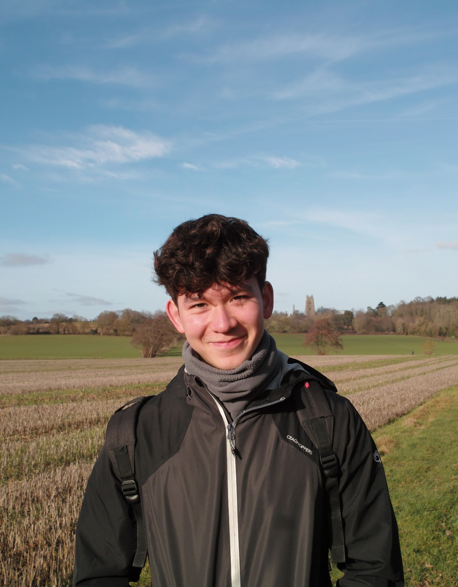

```{r setup, include=FALSE}
knitr::opts_chunk$set(echo = FALSE)
```

## Dr Jo Saul

Dr Jo Saul is the leader of the ISLaND Lab and a Dorothy Hodgkin Research Fellow, funded by the Royal Society. 

She completed her ESRC-funded PhD at UCL in 2020, supervised by Professor Courtenay Norbury in UCL's Department of Language and Cognition. Jo's PhD explored expressive language development in minimally verbal autistic pre-schoolers. She conducted a longitudinal study investigating what predicts individual differences in expressive language development, in particular the role of speech production skills. She also created and piloted an app which delivered a speech sound intervention.

Jo is interested in individual differences in language development and how language impairment impacts mental health, learning and wellbeing. She is passionate about employing open science practices and robust statistical methods to maximise the quality of her research. As mum to a young person with additional needs, she feels strongly that research should reflect the voices of those with lived experience and thus employs participatory research methods and is keen to empower families to play an active role in research. She is also interested in intervention development and evaluation, particularly in how technology may be able to make interventions more accessible to help those with complex neurodevelopmental conditions. 

Jo has been a member of the [the LiLaC lab](http://www.lilac-lab.org/) since 2016. She is also a member of Autistica’s Language and Communication Study Group.

{width=50%}

View Jo's CV [here](www/CV_web.pdf)

View her Google Scholar profile [here](https://scholar.google.com/citations?view_op=list_works&hl=en&user=lOhuIhkAAAAJ).

## Mollie Cooke

Mollie is a research assistant on the project. She recently completed a MSc in Clinical Neurodevelopmental Sciences at Kings' College London and prior to that worked for several years in the voluntary sector providing information, support and advocacy to parents, carers and young people with additional needs. Mollie also has a loved one with complex support needs and she is passionate about including non-speaking and minimially verbal people in research.


## Undergraduate students

We are lucky to be joined by four amazing undergraduate students this year from the BSc, MSci Psychologyn and BSc Psychology and Language Sciences courses. They are doing a great job of coding communicative acts in our video data and supporting our data collection efforts.

### Oliver

{width=50%}


### Saamia 

### Natalie

### Supipi


## Join us!

We hope to grow the lab steadily over the next few years - head to [Get involved](https://josaul14.github.io/get-involved.html) to find out about potential opportunities to join us or collaborate.