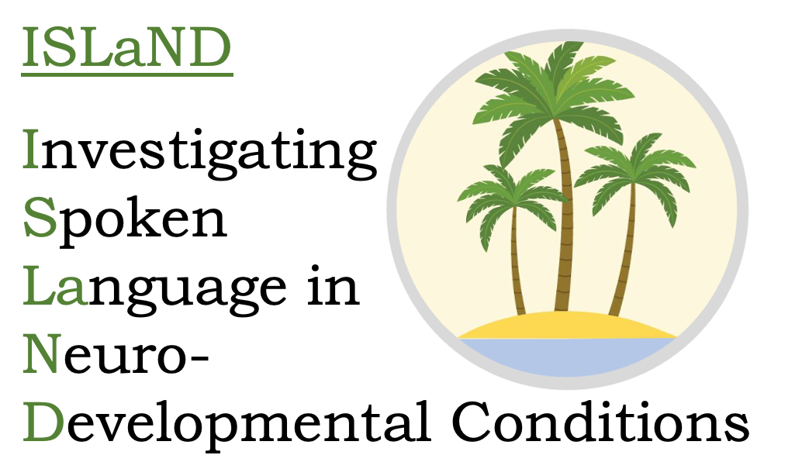

```{r setup, include=FALSE}
knitr::opts_chunk$set(echo = FALSE)
```


## **What is Project ISLaND?**

This project will investigate the prevalence and significance of speech-motor planning difficulties in autism, and how they relate to expressive language development. This will help us understand why some autistic people have difficulty acquiring oral communication skills, and how best to support them.

This work is supported by a Dorothy Hodgkin Research Fellowship awarded to Dr Jo Saul in November 2022: link [here](https://royalsociety.org/news/2023/02/DHF-2022).

{width=100%}
<br>

**Elucidating mechanisms of language growth in minimally verbal autistic individuals**

Language is a uniquely human achievement which most young children accomplish with ease. However, an estimated 25% of autistic people never develop spoken language, remaining minimally verbal or non-speaking. I want to robustly test theories about mechanisms underpinning these individual differences. 

Emerging research hypothesises that speech-motor planning deficits (apraxia) may form an additional barrier to oral communication for some autistic people. I will test this by establishing a large cohort of minimally verbal autistic children (aged 4-12 years), tracking their abilities to use speech as well as alternative forms of communication over the course of 3 years. Taking an inclusive transdiagnostic approach, it will include children regardless of their diagnostic status and any co-occurring conditions. 

I will harness parent-gathered data using technology (e.g. smartphones, wearable devices), to maximise participation and obtain a realistic picture of everyday language use. Later phases of the project will use an app to train speech production directly and assess the impact of improved speech on expressive language and broader communication as well as trialling support that aims to maximise use of augmentative and alternative communication forms.


